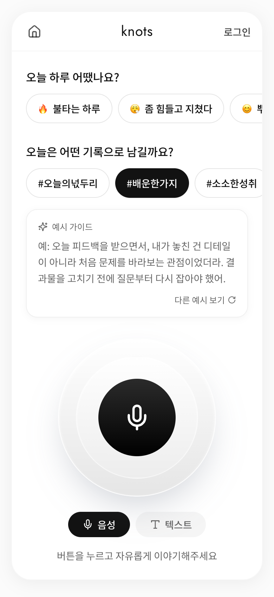
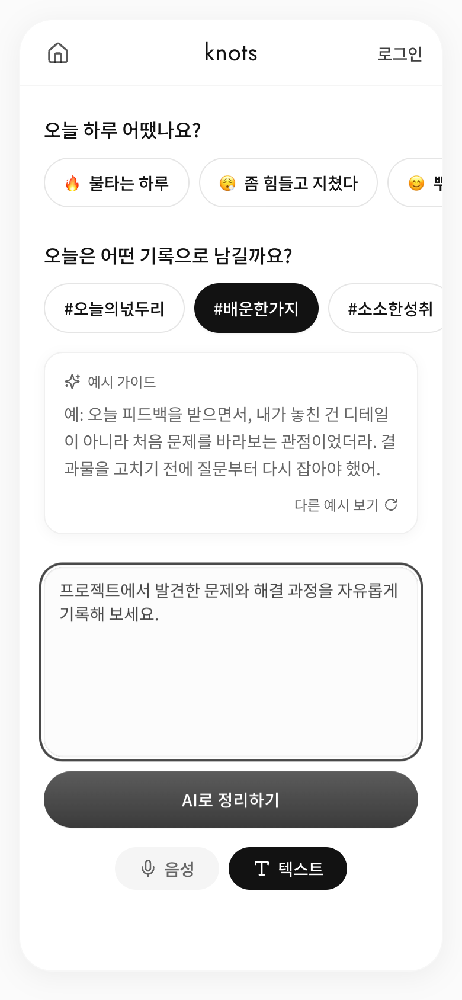

# knots — 데이터로 개선한 Career Branding AI

> 음성이나 텍스트로 남긴 경험을 블로그·LinkedIn·Instagram·Threads용 콘텐츠로 정리하는 AI 서비스입니다.

[라이브 서비스](https://knots-ai.lovable.app) · 개인 프로젝트 · React / TypeScript / Supabase / OpenAI

사용자가 콘텐츠를 만들기 전에 로그인과 온보딩에서 이탈하는 문제를 행동 데이터로 확인했습니다. 가입 전에도 입력과 결과 확인까지 가능하도록 흐름을 바꾸고, 무엇을 말해야 할지 알려 주는 입력 가이드와 녹음 피드백을 보완했습니다. 개선 후 첫 방문 대비 입력 완료율은 **2.8%에서 11.5%로 4.1배** 높아졌습니다.

## 데이터로 제품을 개선한 과정

### 1. 어디에서 이탈하는지 정의

초기 흐름은 `Home → Login → Onboarding 1~3 → Input → Result`였습니다. 사용자가 서비스의 결과를 보기 전에 로그인과 세 단계의 온보딩을 먼저 통과해야 했습니다.

| 관찰한 지표 | 결과 | 해석 |
|---|---:|---|
| 첫 방문 → 로그인 도달 | 11.9% | 가치 경험 전에 가입을 요구해 첫 단계부터 이탈 |
| 로그인 → 온보딩 도달 | 38.1% | 로그인 이후에도 온보딩 진입에서 추가 이탈 |
| 첫 방문 → 입력 화면 도달 | 4.0% | 대부분의 사용자가 핵심 기능을 시도하지 못함 |
| 첫 방문 → 입력 제출 | 2.8% | 초기 Activation 병목으로 정의 |

단순 방문자 수 대신 `first_visit → submit_input → view_result → save_content / click_copy`를 제품 퍼널로 정의했습니다. 특히 사용자가 실제 내용을 제출한 `submit_input`을 초기 Activation의 핵심 지표로 삼았습니다.

### 2. 가설을 제품 흐름으로 구현

**가설 1 — 결과를 보기 전의 로그인 요구가 입력을 막는다.**<br>
게스트도 바로 입력하고 결과를 먼저 확인하게 했습니다. 저장이나 복사처럼 결과를 계속 활용하려는 시점에 로그인하도록 옮기고, 로그인 후에도 작성 중인 결과가 복원되도록 draft와 세션을 연결했습니다.

```text
기존  Home → Login → Onboarding 1 → 2 → 3 → Input → Result
개선  Input → Result 미리보기 → 저장·복사 시 Login → 기존 Result 복원
```

**가설 2 — 빈 녹음 화면만으로는 무엇을 말해야 할지 알기 어렵다.**<br>
감정과 기록 목적을 고르는 칩, 선택한 주제에 맞는 예시 문장, 음성·텍스트 전환을 한 화면에 배치했습니다. 녹음 중에는 마이크 주변 웨이브와 상태 문구로 입력 여부를 바로 확인할 수 있게 했습니다.

**가설 3 — 처리 결과를 기다리는 동안 AI가 무엇을 하는지 보여 줘야 한다.**<br>
결과 화면에서 `핵심 재료 추출 → 핵심 포인트 정리 → 글의 흐름 구성 → 채널별 변환` 과정을 단계로 설명하고, 생성된 네 가지 콘텐츠를 이어서 탐색하도록 구성했습니다.

### 3. 변화 확인

| 첫 방문 대비 행동 | 기존 UX | 개선 UX | 변화 |
|---|---:|---:|---:|
| 입력 제출 `submit_input` | 2.8% | **11.5%** | **4.1배** |
| 결과 확인 `view_result` | 2.8% | **11.5%** | **4.1배** |
| 콘텐츠 저장 `save_content` | 1.1% | **3.8%** | **3.5배** |
| 결과 복사 `click_copy` | 1.1% | **1.9%** | **1.7배** |

수치는 프로젝트 운영 중 수집한 사용자 이벤트를 첫 방문 사용자 기준으로 비교한 결과입니다.

## 실제 화면

아래 화면은 현재 라이브 서비스에서 직접 캡처했습니다.

<table>
  <tr>
    <td align="center" width="33%">
      <br />
      <b>입력 가이드</b><br />기록 목적을 고르면 말할 거리 예시 제공
    </td>
    <td align="center" width="33%">
      <br />
      <b>입력 방식 선택</b><br />같은 맥락에서 음성과 텍스트 전환
    </td>
    <td align="center" width="33%">
      <br />
      <b>결과 이해</b><br />AI 처리 단계와 네 채널 결과를 함께 표시
    </td>
  </tr>
</table>

## 측정 구조

| 사용자 단계 | 대표 이벤트 | 주요 속성 | 확인하려는 것 |
|---|---|---|---|
| Visit | `first_visit`, `session_start`, `page_view` | source, medium, campaign, entry_source | 어떤 유입이 실제 사용으로 이어지는가 |
| Input | `submit_input` | input_type, input_seq, selected_guide_chip | 사용자가 입력을 시작하고 완료했는가 |
| Result | `view_result` | draft_id, generation_status | AI 결과를 실제로 확인했는가 |
| Reuse | `save_content`, `click_copy`, `refine_content` | platform_type, refine_mode | 결과에서 반복 사용 가치를 느꼈는가 |
| Login | `login_success`, `promote_success` | is_guest, draft_id, db_session_id | 로그인 전후 작성 내용이 이어졌는가 |

이벤트는 GA4, Meta Pixel, Supabase에 함께 기록합니다. 익명 방문에는 브라우저 세션 ID를 부여하고, 입력 순서와 UTM 정보를 보존합니다. 가입이 완료되면 게스트 draft를 사용자 세션으로 승격해 로그인 전후 행동을 연결합니다. GA4 원본 이벤트는 BigQuery에서 조회해 개선 전후 퍼널을 비교했습니다.

```text
Meta Ads ─────────────── 노출 · 도달 · CTR · CPC
사용자 행동 ─┬─ GA4 ─── 페이지 · 이벤트 · 유입 경로 ── BigQuery 퍼널 분석
             ├─ Meta Pixel ── 광고 전환
             └─ Supabase ─── 세션 · draft · 결과 · 이벤트
```

데이터가 분석 단계에서 끊기지 않도록 다음 기준을 정했습니다.

- 첫 입력부터 빠지지 않도록 draft를 먼저 만든 뒤 `submit_input`에 `draft_id`를 포함합니다.
- 브라우저 식별자인 `analytics_session_id`와 실제 저장 레코드인 `db_session_id`를 분리합니다.
- 로그인 전후의 같은 작업을 연결할 수 있도록 `draft_id`, `user_id`, 입력 순서를 함께 기록합니다.
- 이벤트 수집 실패가 사용자의 생성 흐름을 막지 않도록 분석 전송을 비동기로 처리합니다.

분석에 사용한 BigQuery 쿼리 구조는 [`docs/analytics/funnel.sql`](./docs/analytics/funnel.sql)에 공개했습니다.

구현 근거는 다음 코드에서 확인할 수 있습니다.

- 이벤트 규격과 세 채널 전송: [`src/lib/track.ts`](./src/lib/track.ts)
- 유입 정보 보존: [`src/lib/acquisition.ts`](./src/lib/acquisition.ts)
- 브라우저 세션과 입력 순서: [`src/lib/session.ts`](./src/lib/session.ts)
- 게스트 결과 복원: [`src/lib/pendingSubmission.ts`](./src/lib/pendingSubmission.ts), [`src/pages/AuthCallback.tsx`](./src/pages/AuthCallback.tsx)
- 게스트 draft 승격: [`supabase/functions/promote-draft/`](./supabase/functions/promote-draft/)

## 제품과 시스템 설계

```text
React / TypeScript
   │
   ├─ GA4 · Meta Pixel ───────────── 유입과 캠페인 성과
   │
   └─ Supabase Auth
        ├─ Postgres + RLS ────────── 사용자·draft·결과·이벤트
        └─ Edge Functions
             ├─ process-audio ───── 음성 인식
             ├─ refine-output ───── 직군·톤을 반영한 결과 생성
             ├─ regenerate-session  전체 결과 재생성
             ├─ update-and-regenerate 사용자 편집 반영
             ├─ promote-draft ───── 게스트 결과를 회원 계정에 연결
             └─ log-event ───────── 행동 이벤트 기록
```

- Supabase RLS로 사용자별 데이터를 격리했습니다.
- 브라우저에는 `anon` 키만 두고 관리자 권한은 Edge Function 환경변수에서 사용합니다.
- 음성 인식, 결과 생성, 재생성, draft 승격을 각각 분리해 실패 지점과 데이터 책임을 구분했습니다.
- 블로그·LinkedIn·Instagram·Threads 결과를 같은 세션에서 생성하고 편집·재생성·저장할 수 있습니다.

## 담당 범위

문제 정의, 사용자 흐름, 화면 구조, 이벤트 택소노미, 핵심 KPI, Supabase 데이터 모델과 권한 정책을 직접 설계했습니다. Lovable을 UI 구현 도구로 사용했으며, 생성된 코드는 실제 사용자 흐름과 데이터베이스 저장 결과를 기준으로 검토하고 수정했습니다. 자세한 구분은 [`CONTRIBUTIONS.md`](./CONTRIBUTIONS.md)에 정리했습니다.

## 로컬 실행

```sh
git clone https://github.com/dbals12/knots-ai.git
cd knots-ai
npm install
cp .env.example .env
npm run dev
```
